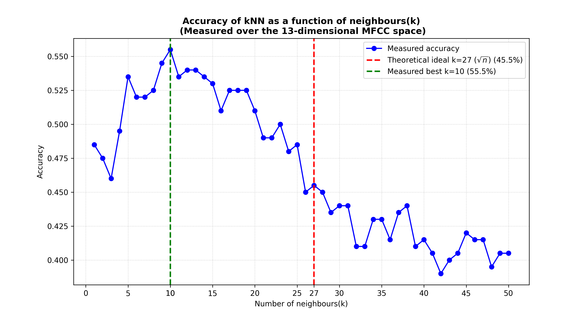
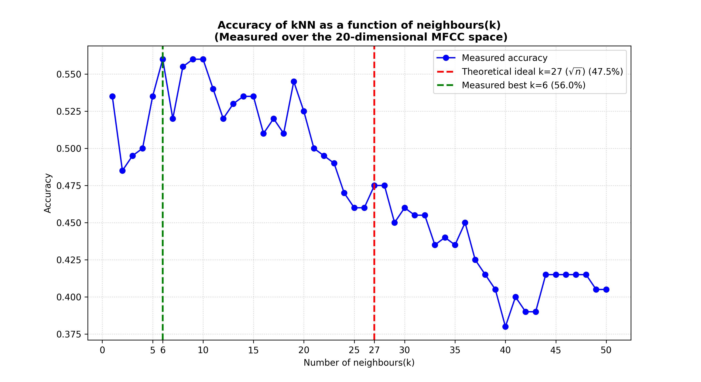
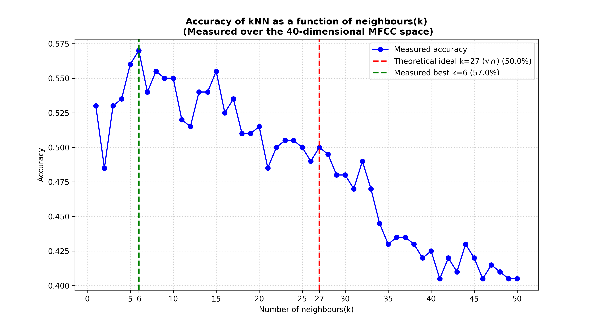
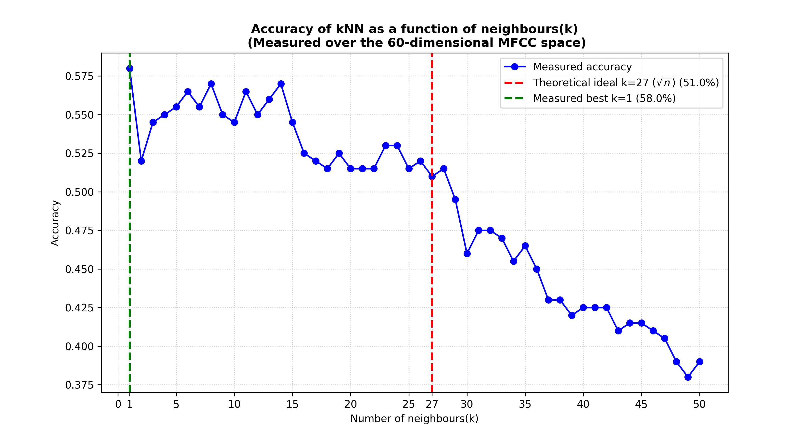

# Music-genre-classification
<br>

## Project Description
This project aims to develop a machine learning model capable of classifying audio tracks into distinct musical genres using the GTZAN dataset. We will use Digital Signal Processing to extract MFCC features from audio files and implement a K-Nearest Neighbors (KNN) algorithm to classify songs into 10 different categories. The goal is to evaluate the model's accuracy in identifying musical patterns across genres like Rock, Jazz, Classical, etc.
<br>
<br>
## Feature extraction

### MFCC (Mel-Frequency Cepstral Coefficients) - librosa library
To extract useable data from our [GTZAN Dataset](http://web-wp.archive.org/web/20220120112420/http://marsyas.info/downloads/datasets.html), we use MFCC. This is important beacuse with this technology we can convert the data into numbers. <br>In this project we are interested in the genre of the music. The genre of music is determined by the timbre. Humans don't hear linearly, meaning that we can precieve small differences between low tones well, for example between 100 Hz and 200 Hz, however, between high tones such between as 1000 Hz and 1100 Hz we cannot preceive small difference well. This is why we should convert the frequencies onto Mel-scale, which mimics the human hearing & logarithmize them also as humans precieve volume logarithmically. We also need to amplify higher frequency sounds because the low tones tend to overwhelm the high tones. <br>For this project we are also going to cut the 30 sec long sound into ~25 ms long sounds because this way they count as staionary singal with which we will be able to work & of course, to convert it into frequencies we are going to use Fast Fourier Transform. After everything we use Discrete Cosine Transform for data compression by discarding noise & eliminating redundant information.<br>All this is included in the librosa library thus we dont have to program it manually.
```python
 amplitude, sampling_rate = librosa.load(new_path)
    mfcc_1 = librosa.feature.mfcc(y=amplitude, sr=sampling_rate, n_mfcc=20) #cuts the songs into ~25ms pieces, saving the 20 first coefficient
    mfcc_mean = np.mean(mfcc_1, axis=1) #taking the mean for each row (20 seperate mfcc value averaged over the whole song)
```
<br>From scientific sources we know that the most important information in human speech and music, the most distinguishable to our ears (accents, formants, timbres) is concentrated in the first 13-20 coefficients. Thus we chose it to be 20 to make it as sensitive as it can be while we also want to keep the system noise-free.

### Data converting & saving
After we extracted the data, we converted them to NumPy arrays. We compressed them and saved them into "music_features.npz" file so later it will be easier & computationally cheaper to use the data for different train models.
```python
np.savez_compressed("music_features.npz", features=x,labels=y)
```
<br>

## Train models

### 1. K-Nearest neighbours





### 2. Support Vector Machine

### 3. Maybe: Random Forest or CNN
